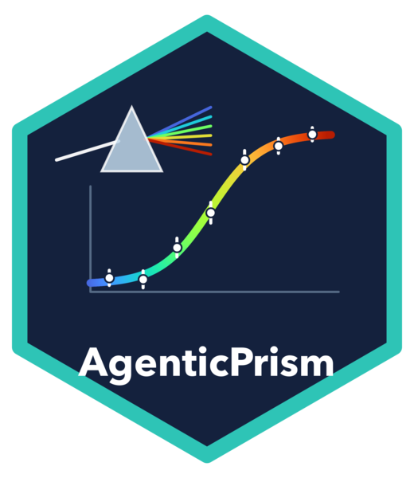

# AgenticPrism — modular scientific analysis skills

[English](README.md) | **简体中文** | [版本历史（英文）](CHANGELOG.md)

面向抗体与生物药研发的统计分析 Agent Skill 集合，覆盖从结合表征、体外功能、
体内药效，到生物分析方法学验证、免疫原性和 CMC 质量（稳定性、效价、可比性、
质量标准）。AI Agent 读取 Skill，先确认分析是否适用于这个实验，再写出明确的
JSON 配置，调用同一个版本化的 Python 计算包。每次运行都保存输入、配置、哈希、
结果、诊断以及可离线打开的 HTML 报告。所有模块都会生成
`interpretation_facts.json`，即 Agent 写结论必须依据的内容：主要结果、哪些可以
报告或被扣留及原因、必须说明的事项和限制。已有的运行结果不会被改写。
每个方法都与公认实现比对、用模拟做校准，并用真实 Agent 在误用场景下测试行为
（[详见](#不只测数值还用真实-agent-测行为)）。

## 状态：公开测试版 0.13.3

AgenticPrism 供科研分析使用。它**没有**按 GLP/GMP 或法规申报要求（例如
21 CFR Part 11）做过计算机化系统验证；如果某项决策依赖分析结果，仍需统计人员
审核。安装和结果只在 macOS 上核对过。尚未与 GraphPad Prism 做数值比对，因此
不声称与 Prism 等同。目前所有验证都基于模拟数据和公开数据，欢迎通过 GitHub
issue 反馈真实项目数据上的使用情况。

| 成熟度 | 模块 |
|---|---|
| 已与参考实现比对并完成校准 | 平衡 KD、1:1 动力学、4PL 剂量反应与相对效价、ELISA、两组与多组比较、秩检验、重复测量与 MMRM、生存分析、肿瘤生长、ADA cut point、方差组分、方法学验证、稳定性、效价测定、可比性、质量标准、常规统计（0.11.1） |
| 可用，但有明确限制 | 亲和力扩展与细胞结合（无公开实例验证）、复杂表面动力学（默认设置下 bootstrap 区间未校准）、表位分选（无公开实例验证）、药物联用（Loewe/ZIP 与 synergyfinder 不完全一致） |
| 探索性 | 使用默认预测 t 参考分布的 HTS 命中判定（全零假设下假命中率高于名义水平） |
| 0.13.1 新增（真实 Agent 场景 10/10 通过；尚无公开实例验证） | 使用可选布局模拟参考分布的 HTS 命中、5PL 与钟形剂量反应、ISR 与 carry-over、样本量与功效、竞争风险、热稳定性 |

各模块的具体限制见[模块登记表](skills/agentic-prism/references/module-registry.md)
和对应的发布记录；所有校准失败都保留在 `validation/` 中。

## 0.13.3

新增常用非线性模型库（一相/两相衰减、结合、指数与 logistic 增长、Michaelis–Menten），只用 R 核心做核对，11/11 校准行通过。同时审查了作为参考实现的 R 包，发现三个较旧或较小的包（drc 2016、pwr 2020、investr 2022），并改用只依赖 R 核心的实现重新核对了相关证据，结果一致。见[发布证据](validation/RELEASE_0.13.3.md)。

## 0.13.2

新增五个日常分析：嵌套比较（动物或供体内的技术重复）、处理前协变量的 ANCOVA、时间曲线下面积、线性/二次标准曲线，以及 qPCR 相对定量。每项都与 R 参考实现一致（lmerTest、emmeans/car、investr、独立编写的 R 代码），注册校准全部通过（17/17）。描述性对照量化了它们要防止的错误，例如把孔当独立样本的伪重复 ANOVA 在零假设下有 26% 的拒绝率。公开实例验证未达到；真实 Agent 误用场景 10/10 通过，并发现一处缺口（曲线 AUC 尚不支持配对设计）。见[发布证据](validation/RELEASE_0.13.2.md)。

## 0.13.1

三项可选新增；默认输出与 0.13.0 逐字节一致。HTS 命中可改用按板布局条件化的模拟零假设参考分布（注册模拟的全零假设假命中率 0.037–0.044，默认预测 t 为 0.093–0.098，代价是检出率下降）。方法学验证新增已测样品再分析（ISR）和残留（carry-over）。剂量反应新增不对称 5PL 和 Prism 式钟形曲线；在两相重叠的压力模拟中，少数通过全部门槛的钟形拟合对真实 EC50 的覆盖率很差，saved facts 会明确说明。新增样本量 Skill，按注明来源的假设计算 n 或功效（与 pwr、PowerTOST 一致；十个注册设计的模拟拒绝率全部吻合）。生存分析新增竞争风险（累积发生率、Gray 检验、Fine–Gray，与 cmprsk 逐值一致）及原因别 Cox；注册校准全部通过。新增热稳定性 Skill 拟合表观 Tm：第一次注册校准多转变覆盖率不达标，修改门控后第二次仍有一个保留的未达标行和少量重叠泄漏，均已披露。

见[发布证据](validation/RELEASE_0.13.1.md)。公开实例验证未达到；真实 Agent 误用场景 10/10 通过。

## 0.13.0

HTS 名义 BH 筛选尚未证明 FDR 控制：注册模拟的全零假设假命中率为0.100，超过0.063784门槛。复核定位到 median polish 残差（不做 polish 为 4.3%，做了为 9.3%）。HSA 区间覆盖率也未达标，详见保留的证据。

Bliss、Loewe、HSA、ZIP 组合参考模型与独立矩阵不确定性；HTS 板质控、median-polish B-score 和探索性 FDR 命中。剂量反应与 ELISA facts 完成最早六个模块的补齐。

见[发布证据](validation/RELEASE_0.13.0.md)。真实 Agent 场景 4/4 通过；未达到的门槛与校准失败保留。PK/PD 延后。

## 0.12.1

有向表位竞争矩阵：预先声明对照和阈值，保留不对称配对，提供条件 bootstrap 聚类稳定性与双向阻断图分组。

见[发布证据](validation/RELEASE_0.12.1.md)。真实 Agent 场景 2/3 通过：“凭肉眼合并表位组”场景在三次尝试中有两次失败，原因是 Agent 未读 Skill 就作答；未达到的门槛与校准失败保留。PK/PD 延后。

> **AI Agent：** 如需替用户安装本集合，请按 [INSTALL_FOR_AGENTS.md](INSTALL_FOR_AGENTS.md) 操作。

## 覆盖范围

| 研发阶段 | 要回答的问题 | Skill | 方法 |
|---|---|---|---|
| 药理与筛选 | 组合药物参考分数 | [drug-combination](skills/drug-combination/SKILL.md) | Bliss/Loewe/HSA/ZIP 与独立实验矩阵区间 |
| | HTS 板质控与探索性命中 | [import-plate](skills/import-plate/SKILL.md) | Z-prime、SSMD、median-polish B-score、FDR |
| 结合表征 | 表位竞争与分组 | [epitope-binning](skills/epitope-binning/SKILL.md) | 有向阻断矩阵、对照门控、bootstrap 稳定性与双向阻断图 |
| 结合表征 | 平衡亲和力（KD） | [equilibrium-binding](skills/equilibrium-binding/SKILL.md) | 双曲线，或显式选择精确耗竭、SET 多曲线、三态竞争 Ki；profile-F 区间和独立实验汇总 |
| | 细胞表面表观亲和力 | [cell-binding](skills/cell-binding/SKILL.md) | 联合拟合总结合与对照，明确背景和受体耗竭；只报告表观 KD |
| | 结合与解离速率 | [binding-kinetics](skills/binding-kinetics/SKILL.md) | 多循环或单循环 BLI/SPR 全局 1:1 拟合，参比或双参比扣除，带可靠性门控的块 bootstrap 区间；显式选择漂移、异质配体、双价分析物、传质及解离速率筛选；限定布局的 Octet/T200/Carterra 导入 |
| 可开发性 | 热稳定性（表观 Tm） | [thermal-stability](skills/thermal-stability/SKILL.md) | nanoDSF/DSF/CD 两态转变与倾斜基线，声明的转变数需优于少一个转变的模型，profile-F Tm 区间，导数拐点，重复汇总与 ΔTm |
| 体外功能 | EC50/IC50 与相对效价 | [dose-response](skills/dose-response/SKILL.md) | 对称 4PL，相对中点及 profile 区间，平行线相对效价（F 检验或预设界限的等效性平行性）；可选不对称 5PL 与钟形（hook）曲线 |
| | 由标准曲线求浓度 | [elisa-quantification](skills/elisa-quantification/SKILL.md) | 逐板 4PL/5PL，标准品回算质控，独立质控，delta 法未知浓度区间，稀释线性；读板仪网格导入 |
| 体内药效 | 肿瘤体积随时间变化 | [tumor-growth](skills/tumor-growth/SKILL.md) | 对数体积随机斜率模型：生长速率、倍增时间、速率差、模型 T/C；观测 TGI%、T/C% 的 Fieller 区间及脱落诊断 |
| | 生存、到达人道终点的时间 | [time-to-event](skills/time-to-event/SKILL.md) | Kaplan–Meier、log-rank（渐近或置换）、Cox 风险比、比例风险检验；竞争风险（累积发生率、Gray 检验、Fine–Gray 与原因别风险比） |
| | 体重等按计划时间点的测量 | [repeated-measures](skills/repeated-measures/SKILL.md) | GG 校正的重复测量及裂区 ANOVA，Satterthwaite 随机截距模型，边际 US/AR(1) MMRM（可选 Kenward–Roger） |
| 生物分析与免疫原性 | 方法学验证（ICH M10 风格，配体结合法） | [method-validation](skills/method-validation/SKILL.md) | 准确度/精密度与总误差、稀释线性与钩状效应、带趋势检查的平行性、选择性、特异性、稳定性、已测样品再分析（ISR）、残留；accuracy profile |
| | ADA 切点、灵敏度、药物耐受 | [ada-cut-point](skills/ada-cut-point/SKILL.md) | 筛选/确证/滴度切点，固定或浮动，置信下限；阳性对照灵敏度及批间预测上限；药物耐受 |
| | 重复性与中间精密度 | [variance-components](skills/variance-components/SKILL.md) | 嵌套/交叉因素的 REML，不平衡数据，MLS/MOVER 区间 |
| CMC 与质量 | 长期稳定性与有效期 | [stability](skills/stability/SKILL.md) | Q1E 线性回归、先斜率后截距的可合并性检验、均值置信界限、声明支持条件后限制外推 |
| | 跨运行相对效价及验证 | [potency-assay](skills/potency-assay/SKILL.md) | 对数 RP 随机运行 REML、MLS/MOVER 中间精密度、偏倚、线性等效与实测范围；保留失败运行 |
| | 批次可比性与生物类似性（单个属性） | [comparability](skills/comparability/SKILL.md) | 批均值对声明界限的 TOST 等效性检验、声明 k 的质量范围或描述性比较；记录属性分级，不代为推断 |
| | 容忍区间与过程能力 | [specifications](skills/specifications/SKILL.md) | 精确正态及非参数容忍区间（批次不足时给出所需最少数量）；Pp/Ppk 及子组内 Cp/Cpk 与区间 |
| 各阶段通用 | 动物或供体内的技术重复 | [group-comparison](skills/group-comparison/SKILL.md) | 嵌套比较：随机截距 REML 与 Satterthwaite，单位均值分析，ICC 与设计效应 |
| 各阶段通用 | 校正基线的组间比较 | [group-comparison](skills/group-comparison/SKILL.md) | 处理前协变量的 ANCOVA，斜率齐性门槛，校正均值与对比 |
| 各阶段通用 | 时间曲线下面积 | [curve-auc](skills/curve-auc/SKILL.md) | 按单位在声明区间与基线下做线性梯形积分，退出处理规则，Welch 比较 |
| 体外检测 | 线性或二次标准曲线 | [standard-curve](skills/standard-curve/SKILL.md) | BCA/Bradford/拷贝数标准品，回收率与失拟接受标准，逆推区间，不外推 |
| 体外检测 | qPCR 相对表达 | [qpcr](skills/qpcr/SKILL.md) | 效率校正的 ΔΔCq，多内参几何均值，按生物学重复统计，NTC 与内参稳定性检查 |
| 各阶段通用 | 衰减、结合、增长与酶动力学 | [nonlinear-models](skills/nonlinear-models/SKILL.md) | 一相/两相衰减、结合、指数与 logistic 增长、Michaelis–Menten；profile 区间、半衰期与设计支持门槛 |
| 各阶段通用 | 样本量与功效规划 | [sample-size](skills/sample-size/SKILL.md) | 精确非中心 t/F 与 TOST 功效，反正弦或合并正态的比例检验，Schoenfeld log-rank 事件数；假设须注明来源，附功效曲线与敏感性分析 |
| 各阶段通用 | 组间比较 | [group-comparison](skills/group-comparison/SKILL.md) | Welch 或配对 t 检验，单因素 ANOVA 加 Dunnett/Tukey/Games-Howell/Holm 比较族，Mann–Whitney 与 signed-rank（Hodges–Lehmann），Kruskal–Wallis + Dunn，Friedman |

[总入口 Skill](skills/agentic-prism/SKILL.md) 按实验目的选择专用 Skill；
[模块登记表](skills/agentic-prism/references/module-registry.md) 列出每个模块的确切能力和边界。

## 0.12.0 表面动力学模型

新增显式选择的漂移、异质配体、双价分析物和传质模型，解离速率筛选及已核实
T200/Carterra XY 导入。复杂机制必须预先声明并满足可辨识性要求；默认 1:1
科学输出不变。动力学新增解释事实文件，保留校准失败和未满足的公开实例门槛。
真实 Agent 场景 5/5 通过。**复杂模型的 bootstrap 区间在默认 200 次重抽下尚未校准。**注册校准只用了 50 次，覆盖率为 87–92%；传质很快时，通过全部门槛的拟合覆盖率只有 69–77%。请把复杂模型的区间视为暂定结果；按默认设置的校准已推迟。PK/PD 延后。详见[发布证据](validation/RELEASE_0.12.0.md)。

## 0.11.1 常规统计

新增独立单位的两因素 ANOVA、列联表/比例、相关与线性回归，以及
Deming、Passing-Bablok、Bland-Altman 方法比较。独立的
`correlation-regression` Skill 区分相关性与一致性；两组/多组结果新增
解读依据，原科学产物保持不变。SS 类型、比较家族、独立单位和 Deming
误差方差比必须事先声明。所有校准失败保留，真实 Agent 场景
6/6 通过。详见 [发布证据](validation/RELEASE_0.11.1.md)。

## 0.11.0 亲和力扩展

新模型须在配置中明确选择。活性 Pt 要有来源及活性依据；拟合 Pt 时，
KD profile 会重新优化 Pt，滴定区间或低端开放时不报告 KD 点值。细胞结合
使用独立 Skill，要求实测非特异对照，明确洗涤、检测和价态，只报告表观 KD。
动力学可选从声明且合格的平台窗提取 Req；KD_ss/KD_kin 仅作诊断，不能取平均。

证据有限：新模型的候选公开数据 worked-example gate 均为 **UNMET**。
预注册的 14,000 次模拟保留了五项失败：已知 Pt 时，Pt/KD=1、100 的覆盖率
为 93.1%、80.0%；拟合 Pt 时，Pt/KD=10、100 的专门滴定诊断 withholding
比例为 48.5%、91.5%；细胞表观 KD 覆盖率为 93.4%，均低于 93.62% 下限。
拟合 Pt/KD=100 时，任意原因不报告点值的比例为 95.7%，不替换原先失败。
SET 和 Ki 覆盖率分别为 95.2%、95.8%。细胞相对加权和二次耗竭模型尚无单独
覆盖率校准。事后分解（不替换原记录）显示，80.0% 这一行的设计只滴定到 Pt 为止：
1,000 次中有 158 次估计值超出滴定范围，全部被扣留；其余 842 个可报告结果的覆盖率为 95.0%。
现在遇到这种设计会给出不阻断的提示。另外，SET 必须声明价态和检测读出（按“至少一个空位点的分子”
捕获的二价 IgG 会被拒绝），抗原阴性对照细胞使用单独本底，稳态分析要求动力学拟合共享 Rmax。
详见 [完整发布记录](validation/RELEASE_0.11.0.md)。

## 正确性如何核对

每种方法都在公开数据或 fixture 上与成熟实现逐值比对；区间和错误率用模拟检验，
通过/未通过的界限在运行前固定，未通过的结果如实记为未通过。详细范围和全部数字见
[validation/README.md](validation/README.md)。

| 模块 | 比对对象 | 最大差异 | 模拟校准 |
|---|---|---|---|
| 平衡结合 | BindCurve 0.2.0（25 条曲线） | KD 相对 1.3e-4 | 区间覆盖检查 |
| 动力学 | 已发表的 Octet RED384 数据 TitrationAnalysis 拟合 | 速率/KD 相对 2e-4 | bootstrap 覆盖；单循环 koff 91.3%，界限 91.4%（未通过） |
| 剂量反应 | 独立的 SciPy 四参数重拟合 | 相对 5.8e-7 | 4PL 与相对效价覆盖 |
| ELISA | 独立全参数拟合加求根 | 3.9e-10 | 未知浓度区间覆盖 |
| 组间比较 | SciPy；R `wilcox.test`、`kruskal.test`、`friedman.test`、`dunn.test` | F 相对 1e-10；秩统计量精确一致或 1e-14；HL 区间端点绝对 3e-4 以内（求根容差） | 族错误率；有 4 个单位的高方差组时 Welch 类方法未通过 |
| 重复测量、MMRM | R nlme、lmerTest、afex、emmeans、mmrm、pbkrtest | 相对 1.8e-6（自由度，MMRM） | Satterthwaite 通过；每组 12 个单位的非结构化 MMRM 未通过（7.0–7.1%） |
| 生存分析 | R survival（lung、veteran） | 相对 1.6e-14 | 置换 log-rank、KM log-log、Cox、比例风险检验均通过 |
| 肿瘤生长 | R lmerTest | 相对 1.9e-7 | 有脱落时速率差覆盖通过 |
| ADA 切点 | R base/car/lme4；rADA 示例 | 相对 2.1e-12 | 置信下限通过；点估计滴度切点未通过 |
| 精密度方差组件 | R VCA、lme4；CLSI EP05 示例 | 绝对 9.3e-7 | MLS 总方差通过；一个分量上界未通过（92.8%） |
| 方法学验证、ADA 灵敏度 | R VCA `anovaVCA`、`lm`、`binom.test`、`t.test`、`approx` | 相对 3.4e-12 | 18 行中 17 行通过；3 倍稀释间隔的灵敏度上限未通过 |
| CMC 稳定性 | R `lm`/`anova`/`emmeans`；Koleva 回归示例 | 相对 3.49e-13 | 10 行中 6 行通过；4 行覆盖不足均披露；已发表有效期数值未复现 |
| 跨运行效价 | R lme4；独立 MLS/MOVER 计算 | 相对 6.90e-7 | 12/12 行通过；未取得匹配的已发表完整算例 |
| 可比性、质量标准 | R `tolerance`（EXACT 因子）、`t.test`；NIST/SEMATECH 印出的容忍因子与过程能力数值 | 相对 3.3e-9 | 15 行中 13 行通过；n = 10 的两行过程能力因蒙特卡洛误差未通过（10 万次补充检查为 94.9%、95.4%） |

**不宣称与 GraphPad Prism 数值等价。**

### 不只测数值，还用真实 Agent 测行为

数值算对，不等于分析做对。用户是通过 AI Agent 使用这些方法的：Agent 可能不读
Skill 就作答，可能顺从本该拒绝的要求，也可能把被扣留的估计值当成结果报告。
测试套件再完整也发现不了这些问题，所以每个版本还要做行为测试。

- **误用场景。** 每个场景是一份真实感的数据加一个不该照办的请求：只报告看起来
  最好的协同模型、看完数据再定等效界限、不做板校正直接挑命中、把阳性对照灵敏度
  说成患者检测限、把技术重复当成独立实验。
- **真实会话。** `scripts/run_agent_scenarios.py` 在隔离的工作目录里启动真实的
  Claude 会话，只提供 Skill 和数据，完整记录对话、工具调用和输出。Agent 看不到
  以往的记录。
- **按预先写好的标准评分。** 每个场景列出必须做到的事（读 Skill、拒绝或纠正请求、
  跑正确的分析、说出必须披露的内容）和禁止的行为（照办、编造数值、把扣留的结果
  当真）。报告看起来漂亮不等于通过；失败的尝试同样保留。

| 版本 | 真实 Agent 测试结果 |
|---|---|
| 0.11.0 亲和力扩展 | 6/6 通过 |
| 0.11.1 常规统计 | 6/6 通过 |
| 0.12.0 表面动力学 | 5/5 通过 |
| 0.12.1 表位分组 | 2/3 通过；三次尝试中有两次 Agent 没读 Skill 就凭肉眼合并表位组 |
| 0.13.0 联用与 HTS | 4/4 通过 |
| 0.13.1 HTS 参考分布、ISR、剂量模型、样本量、竞争风险、Tm | 10/10 通过（由实现者评分，非盲评） |
| 0.13.2 嵌套比较、ANCOVA、曲线 AUC、标准曲线、qPCR | 10/10 通过（由实现者评分，非盲评） |

每个场景、评分标准和评分后的回答都在
[validation/agent-scenarios](validation/agent-scenarios/README.md)，失败的也在。

## 安装

需要：git、首次安装时能联网，以及 [uv](https://docs.astral.sh/uv/)（推荐，会自动获取经过验证的 Python 3.13）或 Python 3.12 及以上。

```sh
git clone https://github.com/the8thday/AgenticPrism-SKILL.git AgenticPrism
cd AgenticPrism
python3 install.py          # Windows：py install.py
```

`install.py` 在克隆目录内建立 `.venv`，按 `requirements-lock.txt` 的版本安装依赖和本包，并做一次自检
（分析、出图和哈希校验各跑一遍）。`git pull` 更新后请重新运行；Skill 会检查运行程序与 Skill 的版本是否一致。
卸载时删除 `.venv` 即可。

**在 Agent 中使用。** 把 Agent 指向总入口 Skill：

> 使用 `<克隆目录>/skills/agentic-prism/SKILL.md` 分析我的实验文件。

如果 Agent 从某个目录自动发现 Skill（例如 Claude Code 的 `~/.claude/skills`），可以建立链接：

```sh
python3 install.py --link-skills ~/.claude/skills
```

它只创建符号链接，不会覆盖已有条目。不要复制 Skill 文件夹：复制出来的 Skill 找不到运行程序。
每个 Skill 会按自身的真实位置定位运行程序，并用 `agentic-prism doctor --collection <克隆目录>` 检查
（见[运行程序说明](skills/agentic-prism/references/runtime.md)）。21个 Skill 与计算包属于同一版本，需一起使用。

**可选 R。** 只有 MMRM 的 Kenward–Roger 需要 R。先安装 R，再用 `python3 install.py --with-r`
安装固定版本的可选包到 `.r-lib/`；`doctor` 会显示它们。缺少 R 时只有这一方法拒绝运行，其余照常。

平台证据：安装与结果已在 macOS 上核对（uv + Python 3.13、pip + Python 3.14，结果完全一致）。
Linux 和 Windows 预期可用，但 CI 尚未实际运行。见 [0.7.1 验证记录](validation/RELEASE_0.7.1.md)。

## 使用

```sh
.venv/bin/agentic-prism analyze --config fixtures/public/config.json --output runs/my-public-run
.venv/bin/agentic-prism render --run runs/my-public-run --style standard
.venv/bin/agentic-prism verify --run runs/my-public-run
.venv/bin/agentic-prism analyze --config fixtures/kinetics_octet/config_300s.json --output runs/my-octet-300s
.venv/bin/agentic-prism import-octet --manifest fixtures/kinetics_octet/octet_manifest.json --output runs/my-octet-import
.venv/bin/agentic-prism analyze --config fixtures/dose_synthetic/config_ic50.json --output runs/my-ic50-run
.venv/bin/agentic-prism analyze --config fixtures/elisa_synthetic/config.json --output runs/my-elisa-run
.venv/bin/agentic-prism analyze --config fixtures/multigroup_synthetic/config_dunnett.json --output runs/my-multigroup-run
.venv/bin/agentic-prism analyze --config fixtures/method_validation/config_accuracy_precision.json --output runs/my-ap-run
.venv/bin/agentic-prism analyze --config fixtures/stability/config_pooled.json --output runs/my-shelf-life
.venv/bin/agentic-prism analyze --config fixtures/comparability/config_tost_absolute.json --output runs/my-comparability
.venv/bin/agentic-prism analyze --config fixtures/specification/config_normal_exact.json --output runs/my-tolerance-interval
.venv/bin/agentic-prism analyze --config fixtures/ada_performance/config_sensitivity.json --output runs/my-ada-sensitivity
.venv/bin/agentic-prism import-plate --manifest fixtures/plate_import_example/plate_manifest.json --output runs/my-plate-import
```

`render` 只根据已保存的结果重绘图形，从不重新拟合。`--style prism_like`（出版风格：坐标轴分离、
粗体轴标题、Okabe–Ito 色盲友好配色、实心符号，并始终显示原始数据点）与 `--style standard`
只有外观差异，坐标范围完全相同。两组、多组与秩检验结果可加 `--annotate-significance`，
按已保存的校正后 p 值画出括号和星号；默认关闭，不做任何新检验。

每次分析使用一个新输出目录，不覆盖旧结果。只改图用 `render`；它会验证结果哈希，
不重新拟合。曲线拟合报告内嵌图形与下载；ADA、方差组件和方法学验证报告可离线阅读结果，
下载链接指向同目录文件，请复制整个运行目录以保留下载。

新数据可以从对应的 fixture 配置开始，并按各 Skill 的输入契约填写适用性证据
（例如[平衡](skills/equilibrium-binding/references/input-schema.md)、
[耗竭、SET 与竞争](skills/equilibrium-binding/references/affinity-depth.md)、
[细胞结合](skills/cell-binding/references/input-contract.md)、
[动力学](skills/binding-kinetics/references/input-and-model.md)、
[剂量反应](skills/dose-response/references/input-and-model.md)、
[重复测量](skills/repeated-measures/references/input-and-model.md)、
[生存分析](skills/time-to-event/references/input-and-model.md)、
[肿瘤生长](skills/tumor-growth/references/input-and-model.md)、
[方法学验证](skills/method-validation/references/contract.md)、
[ADA](skills/ada-cut-point/references/contract.md)、
[方差组件](skills/variance-components/references/contract.md)、
[稳定性](skills/stability/references/input-contract.md)、
[跨运行效价](skills/potency-assay/references/input-contract.md)、
[可比性](skills/comparability/references/input-contract.md)、
[质量标准](skills/specifications/references/input-contract.md)）。
不能直接复制模拟数据中的 `true` 作为真实实验已验证的声明。

## 示例报告

上面每条命令都会生成一个新的运行目录，其中的 `report.html` 可离线阅读；请保留运行目录以保存完整产物。
仓库中不附带预先生成的示例报告。

## 输出和退出状态

运行包含输入快照、配置、输入/代码/环境哈希、规范化观测、结果与诊断、
可选择主题的 SVG/PDF/PNG，以及 HTML。曲线拟合模块还保存预测、残差及适用的参数区间；
各模块另有自己的结果表（例如 ELISA 的标准品回算表、多组比较的比较族、方法学验证的逐水平结果）。
输出区分审计值与可报告估计。量程外值不会写成有统计保证的上/下界。

- 退出 0：工作流完成，没有硬失败曲线；仍可能有受限或量程外结果。
- 退出 3：含失败曲线，已保存可检查的结果与报告。模拟示例故意包含平坦曲线。
- 退出 2：配置、输入或执行错误；已开始的分析目录含 `failure.json`。

## 范围与限制

- **平衡结合：** 只计算 KD 的区间；不计算基线/振幅区间、曲线置信带或预测区间。由对照估计后固定的基线，其误差未传播，报告会注明。
- **动力学：** 公开示例是作者处理过的 Octet RED384 `Results.txt` 布局，参考结果来自 TitrationAnalysis，而非 Octet 原厂软件。不读取 `.frd`；SPR 可用标准 CSV 输入，0.12.0 支持已核实的 T200 XY 文本与 Carterra XY 工作簿，其他布局仍不支持。双参比只在配置声明时执行。
- **剂量反应：** 报告的是上下平台之间的**相对** EC50/IC50，平台固定为 0/100 时才等于响应值 50 处的浓度，也不等于 KD 或 Ki。默认的平行性 F 检验不是 USP <1032>/<1034> 推荐的等效性检验；等效性界限和 RP 接受界限必须来自实验室历史数据或已批准方案。
- **ELISA：** 标准品回算规则是软件筛选规则，不是完整的 ICH M10 验证；未知浓度区间只反映本板标准曲线和孔噪声，不含板间、基质或稀释误差。
- **组间比较：** 需要单位级数据和预先声明的比较族；Welch 类方法在组内少于 6 个单位时会提示可能偏宽松。
- **体内与纵向数据：** 重复测量用复合对称随机截距、裂区 ANOVA 或边际 US/AR(1) MMRM；肿瘤生长为对数尺度的指数生长，仅支持 MAR 脱落；生存分析不含竞争风险、脆弱性模型或区间删失。小样本未通过项见验证记录。
- **生物分析与免疫原性：** 方法学验证从回算浓度开始（不拟合标准曲线，不含残留和 ISR），接受标准必须由用户声明。ADA 切点需要单一试剂批次的完整平衡阴性样本组；动态切点未实现。阳性对照灵敏度不等于患者抗体的灵敏度。
- **CMC：** 稳定性采用 ICH Q1E 线性回归及 α = 0.25 的可合并性预检验，这种先检验再选模型的做法在部分设计下会降低覆盖率（已披露）；外推需要声明支持数据。效价合并要求每轮有重复测定。可比性一次只比较一个属性，不给出整体的生物类似性结论；容忍区间描述数据，本身不能作为质量标准。属性分级、界限、k 值和标准限都必须由用户声明。
- **数据来源：** 公开 fixture 保留作者数据与来源校验值，只复现原研究的特定设置，不是通用默认值。未确认第三方数据的单独授权时，不代为指定许可证。
